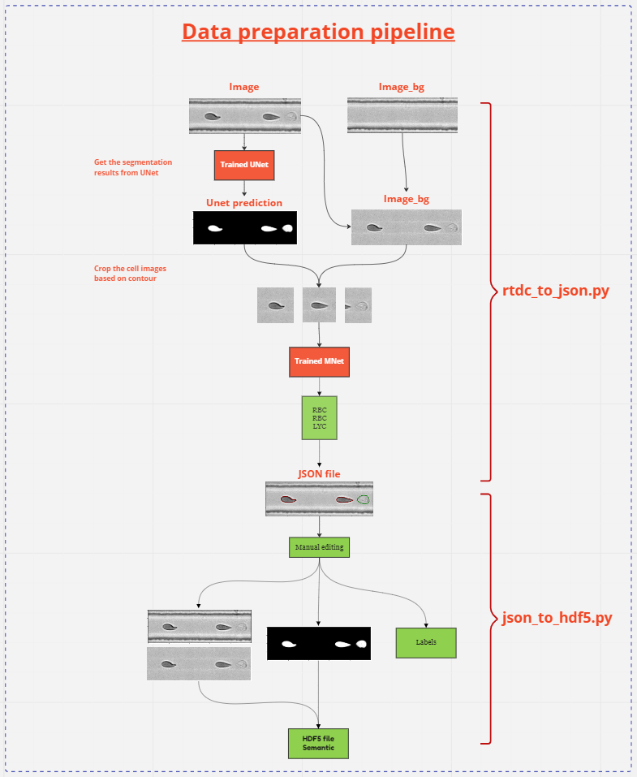

# SemanticSegmentor

In this repository, the UNet model (semantic segmentation) data preparation and training code are stored.

```bash
python -m unet --params_path params/unet_params.yaml
```

## Installation

1. Install git lfs to clone the model checkpoints:  
```bash
git lfs install
```

2. Clone the project:  
```bash
git clone git@gitlab.gwdg.de:blood_data_analysis/SemanticSegmentor.git
```
3. Go to the project directory:
```bash
cd SemanticSegmentor
```

3.Install the project in editable mode:  
```bash
pip install -e .
```


# Model training
NOTE: DVC has not implemented yet for data versioning, so for time being, dataset has been placed in `lfs`.
You can also get the data from from the HSMFS shared-drive `U:\Members\Raghava\Benchmark_UNet\new_segm_dataset.hdf5` 
manually.

## With params file:

Change the required parameters in `unet_params.yaml` file and then run the below command for training

```bash
model:
  type: "UNet"
  in_channels: 1
  out_classes: 1
  bilinear: False
  depth: 4
  filters: 5
  dilation: 2
  dropout: False
  up_mode: 'upconv'
  with_attn: True

dataset:
  type: "PNG"
  data_path: data/training_testing_set/training
  augmentation: False
  valid_size: 0.2
  batch_size: 8
  
  # Mean and std values for the whole dataset should be computed before
  # starting the training using 'unet/dataset_utils/compute_mean_std.py'
  # script. The computed values can be used during the model inference.
  # If there is a change in the dataset (either inclusion or exclusion of
  # image and mask pairs into the dataset), we need to recalculate the mean
  # and std values of the dataset.
  mean: [0.67709]
  std: [0.13369]
  # how many subprocesses to use for data loading. 0 means that the data
  # will be loaded in the main process.
  num_workers: 0
  # 'num_samples' is useful for testing. Irrespective of the number of
  # samples available in the dataset, trainer takes "num_samples" from
  # the dataset to run the test pipeline. If you do actual training set
  # this to "null"
  num_samples: null

criterion:
  type: "FocalTverskyLoss"
  alpha: 0.3
  beta: 0.7
  gamma: 0.75

metric:
  type: "IoUCoeff"

optimizer:
  type: "Adam"
  learn_rate: 0.001

# Decays the learning rate by ``lr_decay_rate`` every ``lr_step_size``
# epochs. Sometimes model might be ended up within local minima because
# of the high learning rate. A scheduler will help the model overcome
# this by minimizing the learning rate progressively.

# NOTE: instead of using step based scheduler, the adaptive scheduler
# could be more effective to get optimal results.
scheduler:
  type: "stepLR"
  lr_step_size: 10
  lr_decay_rate: 0.1

max_epochs: 3
use_cuda: True
path_out: "experiments"

# Trainer start saving checkpoints only after the validation
# accuracy is higher than  'min_ckp_acc'
min_ckp_acc: 0.9

# If the model metric (validation loss) starts increasing,
# 'early stopping' will count the n consequent epochs (patience).
# If still there is no improvement (after patience) training will
# be terminated automatically. It saves computational power by
# discarding the unnecessary epochs.
early_stop_patience: 10

# Start the training where you left by providing
# previous checkpoint (not jit) path
init_from_ckp: null

# Specify whether results should be saved with tensorboard
tensorboard: True
```

```bash
# Train a model with parameters
python -m unet --params_path "params/unet_params.yaml"
```

During training, a folder (`experiments`) will be created to save the outcome of experiments. Moreover, 
sub-folders will be created based on date and time of the experiment, and model checkpoints 
(at different validation accuracies), train logs, and plots will be saved there. Checkpoint path 
consists of epoch number and validation accuracy like example below.
```bash
E24_trainAcc_9304_validAcc_9083_jit.ckp  >>>  E{checkpoint number}_trainAcc_{training accuracy}_validAcc_{validation accuracy}_{type of model}.ckp
```

## Without params file (optional):
Sometimes, we want to train a model in jupyter notebooks because:
- We can apply trial and error method to select hyper-parameters quickly
- To visually inspect data samples before and after transformations, to see some stats (shapes, normalization, image ranges)
- To see the model convergence progress
- It is easy to debug and test

There is an example notebook in the repo `training_notebook.ipynb`. You can use it for training.


### How to use and create dataset object:

We can create dataset object with `json_files_path` as well as `hdf5_file_path` as shown below.
```bash
from unet.ml_dataset import UNetDataset

AUGMENT = False
MEAN = [0.6795]
STD = [0.1417]

data_path = "data/training_dataset/"  # it should consists of images and masks folders
json_path = r"C:\Raghava_local\BENCHMARK_DATA\test"

# With png images and masks
unet_dataset = UNetDataset.from_png_files(data_path, AUGMENT, MEAN, STD)

# With json_files_path
unet_dataset = UNetDataset.from_json_files(json_path, AUGMENT, MEAN, STD)

# With hdf5_file_path
unet_dataset = UNetDataset.from_hdf5_data(hdf5_path, AUGMENT, MEAN, STD)
```
Data splitting for training and validation. As you can see below, `data_dict` is a pathon dictionary 
contains dataset objects for both `training` and `validation`
```bash
from unet.ml_dataset import split_dataset

VALID_SIZE = 0.2

data_dict = split_dataset(unet_dataset, VALID_SIZE)
```

Finally, create dataloaders
```bash
from unet.ml_dataset import create_dataloaders

BATCH_SIZE = 8
NUM_WORKERS = 0

dataloaders = create_dataloaders(data_dict, BATCH_SIZE, NUM_WORKERS)
```

Instead, if you have all the parameters in `params.yaml` file, we can simply create dataloaders with 
`get_dataloaders_with_params()` function like below.

```bash
from unet.ml_dataset import get_dataloaders_with_params

dataloaders = get_dataloaders_with_params(params)
```

### Create a model object:
```bash
from unet.ml_models import UNet, UNetTunable, get_model_with_params

# With params file
unet_model = get_model_with_params(params)

# Without params file

IN_CHANNELS = 1
OUT_CLASSES = 1

unet_model = UNet(n_channels=IN_CHANNELS, n_classes=OUT_CLASSES)
```

### Create a criterion object:
```bash
from unet.ml_criterions import FocalTverskyLoss, get_criterion_with_params

# With params file
criterion = get_criterion_with_params(params)

# Without params file

ALPHA = 0.3
BETA = 0.7
GAMMA = 0.75

criterion = FocalTverskyLoss(alpha=ALPHA, beta=BETA, gamma=GAMMA)
```

### Create a metric object:
```bash
from unet.ml_metrics import IoUCoeff, get_metric_with_params

# With params file
metric = get_metric_with_params(params)

# Without params file
metric = IoUCoeff()
```
### Create an optimizer object:
```bash
from torch.optim import Adam, lr_scheduler
from unet.ml_optimizers import get_optimizer_with_params

# With params file
optimizer = get_optimizer_with_params(params, model)

# Without params file

LEARN_RATE = 0.001

optimizer = Adam(unet_model.parameters(), lr=LEARN_RATE)
```

### Create a scheduler object:
```bash
from torch.optim import lr_scheduler
from .ml_schedulers import get_scheduler_with_params

# With params file
scheduler = get_scheduler_with_params(params, optimizer)

# Without params file

LR_STEP_SIZE = 10
LR_DECAY_RATE = 0.1

scheduler = lr_scheduler.StepLR(optimizer=optimizer,
                                step_size=LR_STEP_SIZE,
                                gamma=LR_DECAY_RATE)
```

### Create a trainer object:
```bash
from unet.ml_trainer import SetupTrainer

# With params file
trainer = SetupTrainer.with_params(params)

# Without params file

MAX_EPOCHS = 5
USE_CUDA = True

# Trainer start saving checkpoints only after the validation
# accuracy is higher than  'min_ckp_acc'
MIN_CKP_ACC = 0.8

# If the model metric (validation loss) starts increasing,
# 'early stopping' will count the n consequent epochs (patience).
# If still there is no improvement (after patience) training will
# be terminated automatically. It saves computational power by
# discarding the unnecessary epochs.
EARLY_STOP_PATIENCE = 10

PATH_OUT = "experiments"


trainer = SetupTrainer(model=unet_model,
                       dataloaders=dataloaders,
                       criterion=criterion,
                       metric=metric,
                       optimizer=optimizer,
                       scheduler=scheduler,
                       max_epochs=MAX_EPOCHS,
                       use_cuda=USE_CUDA,
                       min_ckp_acc=MIN_CKP_ACC,
                       early_stop_patience=EARLY_STOP_PATIENCE,
                       path_out=PATH_OUT,
                       tensorboard=True,
                       init_from_ckp=None)
 
 # Training
 trainer.start_train()
```

# Model Training on HPC:
1. Clone the project in the local machine
```bash
git clone git@gitlab.gwdg.de:blood_data_analysis/SemanticSegmentor.git
```
2. change required parameters in `params/unet_params.yaml`. Especially,
- num_workers >  to `8`
- num_samples > to `null` 
- max_epochs > `100` may be
- use_cuda > `True`

3. change the following information in `train_hpc.sh` file.
- `JOB NAME`
- ``EMAIL ADDRESS``

4. Copy the loacl `SemanticSegmentor` repo into HPC by running the below command in `bash` terminal
```bash
scp -r SemanticSegmentor/ <USERNAME>@raven.mpcdf.mpg.de:/u/<USERNAME>
```
5. Open the HPC terminal, go to the `SemanticSegmentor` folder, and then run the below command to for training.
```bash
sbatch train_hpc.sh
```
6. Copy the experiments (trained models) from HPC to local drive
```bash
scp -r <USERNAME>@raven.mpcdf.mpg.de:/u/<USERNAME>/SemanticSegmentor/experiments <path to local directory>
```

# Model Inference using dcevent:
## Locally:
1. Clone dcevent package
```bash
git clone git@gitlab.gwdg.de:blood_data_analysis/dcevent.git
```
2. Install dcevent with `ml` dependencies
```bash
pip install -e .[ml]
```
Then you can able to see `mlunet` segmentation available in dcevent

3. See the CLI options
```bash
dcevent process --help
```

```bash
Options:
  -b, --background-method [rollmed|sparsemed]
                                  Background computation method to use
  -kb KEY=VALUE                   Optional ``KEY=VALUE`` argument for the
                                  specified background method
  -s, --segmentation-method [legacy|mlunet|otsu|std|watershed]
                                  Segmentation method to use
  -ks KEY=VALUE                   Optional ``KEY=VALUE`` argument for the
                                  specified segmenter
  -f, --feature-method [extended|legacy]
                                  Feature extractor to use
  -p, --pixel-size FLOAT          Set/override the pixel size for feature
                                  extraction [µm]
  --replace-background            Force recomputation of background data prior
                                  to segmentation; i.e. if there are already
                                  background data, ignore them
  --reproduce                     Reproduce the online analysis using Shape-In
                                  defaults and online parameters taken from
                                  ``PATH_IN``
  --num-frames INTEGER RANGE      Total number of frames to read from input
                                  file; By default, the entire input file is
                                  read  [x>=1]
  --num-cpus INTEGER RANGE        Number of CPUs to use  [1<=x<=16]
  --help                          Show this message and exit.
```
4. How to use dcevent
```bash
dcevent process <rtdc path_in> <optional rtdc path_out> -s <segmentation method> -ks <keyword aruguments>
```

```bash
NOTE: `-ks` is not sepcifc to the `mlunet`. Arguments that are used by other segmentors are also passed 
via -ks. However, for `mlunet`, you might want to pass particulary two arguments:

- checkpoint = path to the model checkpoint (.ckp or .pth file)
- cuda_device = bool
```
5. Run dcevent on `.rtdc` dataset (you can choose one option below)

- Machine without cuda & with default checkpoint
```bash
dcevent process "test_data/test.rtdc" "test_data/test_unet.rtdc" -s mlunet
```
- Machine with cuda & default checkpoint
```bash
dcevent process "test_data/test.rtdc" "test_data/test_unet.rtdc" -s mlunet -c
```
- Machine with cuda & with new checkpoint
```bash
dcevent process "test_data/test.rtdc" "test_data/test_unet.rtdc" -s mlunet -ks checkpoint = "new_model.ckp" cuda_device=True
```
If the user doesn't provide `checkpoint` through CLI (-ks), Default model checkpoint 
that is stored in `dcevent/dc_segment/segm_ml_unet/checkpoints` (git-lfs file) folder is used.

## On HPC:
TODO


## Data perparation (labelme) -- Not using anymore

We are using a semi-automated labeling process to create a dataset for UNet training 
which means, instead of creating segmented labels from scratch, we use classification 
and segmentation models that are being trained before as estimates to generate the initial 
version of the label, and then we edit manually if it still does not meet the requirements.

``NOTE:`` To run the data preparation pipeline, use `test.rtdc` dataset from `data` directory
### Step-1:
- Take a `.rtdc` dataset that you want to include in the training data.
  - ``NOTE:`` dataset should contain `image_bg` and `ml_score` features (dcevent & ml predictions)
- Produce `.json` files (that can be opened in labelme-GUI) with the help of bloody_bunny 
  (new model with minmax normalization) and unet model predictions. 
- Use `rtdc_to_json.py` script to do so. 
- To see the options:

```bash
python unet/cli/rtdc_to_json.py --help
```
```bash
Options:
  --path_in FILE         Path to RTDC dataset (.rtdc)
  --path_out PATH        Path to save output files (images, JSON files). If it
                         is not given, script creates new folder based on
                         `path_in`
  --bb_ckp_path FILE     Path to bloody_bunny model checkpoint. If it is not
                         given default checkpoint is taken from model folder
  --unet_ckp_path FILE   Path to unet model checkpoint. If it is not given
                         default checkpoint is taken from model folder
  -s, --min_score FLOAT  Specify minimum probability of `ml_score` feature
  -m, --ml_feat_kv TEXT  KEY=VALUE argument for cell_type and num_samples
                         pairthat needs to be extracted from RTDC dataset.i.e
                         `ml_score_r1f=10` If it is not given,
                         `ml_score`features in dataset are used to generate
                         labelme samples(by default 50 samples from each type)
  -c, --is_cuda          Specify whether cuda device available or not
  --help                 Show this message and exit.
```
- Use the test dataset that is stored (`git lfs`) in data folder
```bash
python unet/cli/rtdc_to_json.py --path_in "data/test.rtdc" -s 0.8 -m ml_score_r1f=10 -c
```
- The above command randomly extracts 10 `ml_score_r1f` events (images, image_bg, and json files) 
that have `ml_score` more than 0.8 (argument `-s 0.8`) from the given `rtdc` dataset.
- Four directories will be created namely `image`, `image_bg`, `unet_predicts` and `labelme` 
- The extracted events (image, image_bg, and json files) are saved with names consisting of dataset name, 
frame number, and index number as follows.
```bash
# In image folder
{DATASET_NAME}_frm_{FRAME_NUMBER}_idx_{INDEX_NUMBER}_img.png  >>  image file

# In image_bg folder
{DATASET_NAME}_frm_{FRAME_NUMBER}_idx_{INDEX_NUMBER}_img_bg.png  >>  image_bg file

# In image_bg folder
{DATASET_NAME}_frm_{FRAME_NUMBER}_idx_{INDEX_NUMBER}_pred.bmp  >>  unet prediction (binary mask)

# In labelme folder
{DATASET_NAME}_frm_{FRAME_NUMBER}_idx_{INDEX_NUMBER}_interpolated.png  >>  upscaled image file
{DATASET_NAME}_frm_{FRAME_NUMBER}_idx_{INDEX_NUMBER}_interpolated.json  >>  upscaled json file


#Example:
BH116_01_frm_746198_idx_179581_img.png
BH116_01_frm_746198_idx_179581_img_bg.png

BH116_01_frm_746198_idx_179581_interpolated.png
BH116_01_frm_746198_idx_179581_interpolated.json
```
### Step-2:
See the Manual editing [guidelines](https://gitlab.gwdg.de/blood_data_analysis/blood_data_analysis/-/wikis/Analysis/MachineLearning/CellSegmentation/segmentation-labeling-guidelines) 


### Step-3:

Convert `.json` files into `.hdf5` file that contains images and binary mask. 
Use `json_to_hdf5.py` script to do so.

```bash
python unet/json_to_hdf5.py --help
```
```bash
Options:
  --path_in PATH   Path to .json files folder
  --path_out FILE  Optional. Path to save output (.hdf5) file
  --help           Show this message and exit.
```
- To use:
```bash
python unet/json_to_hdf5.py --path_in "data/data_labelme" --path_out "data/data_labelme/test.hdf5"
```

`NOTE:`Creating `.hdf5` from `.json` files is optional because we can train 
a model either `.hdf5` file or `.json` files.

### The complete pipeline somthing looks like the below picture:


